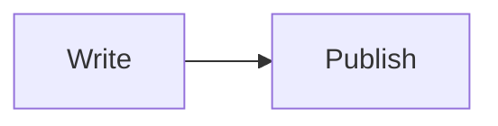

# Hypo.md

A tiny, self-hosted Markdown notes server. Drop your `.md` files into a
folder, run the server, and browse them through a clean web interface with a
sidebar tree, wiki-style links, syntax highlighting, and Mermaid diagrams.

Named after the idea that notes should be a _hypothesis_ — quick to write,
easy to link, and always one refresh away from being wrong.

## Features

- 📁 **Folder-based navigation** — your directory structure becomes the sidebar tree.
- 🔗 **Obsidian-style wiki links** — `[[Note Name]]`, `[[Note#Heading]]`, `[[Note|Label]]`.
- 🎨 **Syntax highlighting** for code blocks via highlight.js.
- 📊 **Mermaid diagrams** rendered client-side, with dark/light theming.
- 🌗 **Light & dark themes** that follow the system preference, with a manual toggle.
- 📱 **Responsive layout** — collapsible sidebar on mobile, sticky sidebar on desktop.
- 🈶 **Transliteration-aware slugs** — Cyrillic note and folder names become clean ASCII URLs.
- ⚡ **Zero build step** — plain Node.js + Express, no bundler, no framework.

## Requirements

- Node.js 18 or newer
- npm (or any package manager you like)

## Installation

```bash
git clone <your-repo-url> hypo.md
cd hypo.md
npm install
```

## Usage

Put your Markdown files anywhere under the notes directory (default: `./notes`):

```
notes/
├── Projects/
│   ├── hypo.md.md
│   └── Roadmap.md
└── Welcome.md
```

Start the server:

```bash
node server.js
```

Then open http://localhost:3000 in your browser.

## Configuration

The server reads two environment variables:

| Variable    | Default   | Description                                |
| ----------- | --------- | ------------------------------------------ |
| `PORT`      | `3000`    | Port to listen on.                         |
| `NOTES_DIR` | `./notes` | Path to the folder containing `.md` files. |

Example:

```bash
PORT=8080 NOTES_DIR=/home/me/vault node server.js
```

## Markdown extensions

### Wiki links

```markdown
[[Welcome]] → links to /welcome
[[Welcome|Start here]] → custom label
[[Welcome#Installation]] → links to a heading inside another note
[[#Installation]] → links to a heading in the current note
```

Slugs are generated by transliterating Cyrillic to Latin and replacing
spaces with underscores, so `Проекты/Дорожная карта.md` becomes
`/proekty/dorozhnaya_karta`.

### Code blocks

Fenced code blocks are highlighted automatically. Specify a language for
exact matching:

````markdown
```js
console.log("hello");
```
````

### Mermaid diagrams

Use `mermaid` as the language:

````markdown

````

Diagrams re-render when you switch themes.

## Project structure

```
hypo.md/
├── server.js                  # entry point
├── src/
│   ├── config.js              # PORT, NOTES_DIR
│   ├── utils/
│   │   ├── translit.js        # slugify + Cyrillic transliteration
│   │   └── html.js            # escapeHtml
│   ├── notes/
│   │   ├── scan.js            # recursive directory scan
│   │   └── find.js            # slug-based lookup
│   ├── markdown/
│   │   ├── index.js           # renderMarkdown()
│   │   ├── heading-ids.js     # unique heading anchors
│   │   ├── renderer.js        # code + heading renderers
│   │   └── wiki-link.js       # [[...]] extension
│   ├── views/
│   │   ├── page.js            # HTML shell
│   │   ├── tree.js            # sidebar tree renderer
│   │   ├── styles.css         # all styles
│   │   └── client.js          # theme toggle, mobile nav, Mermaid
│   └── routes/
│       ├── home.js            # GET /
│       └── note.js            # GET /*
└── notes/                     # your Markdown files
```

## How it works

1. On every request the notes directory is scanned recursively into a tree
   of files and folders, each with a transliterated slug.
2. The URL path is split into slug segments and matched against the tree.
3. Matched files are parsed with `marked`, augmented with two custom
   renderers (headings get stable IDs; code blocks are highlighted) and a
   wiki-link inline extension.
4. The result is injected into a single HTML template that also renders the
   sidebar tree.

## Limitations

- Slug collisions are not resolved — two folders named `Заметки` and
  `Zametki` will both map to `zametki`.
- Read-only: there is no editor, search, or tag system (yet).

## License

This project is licensed under the MIT License. See the [LICENSE](LICENSE) file for details.
